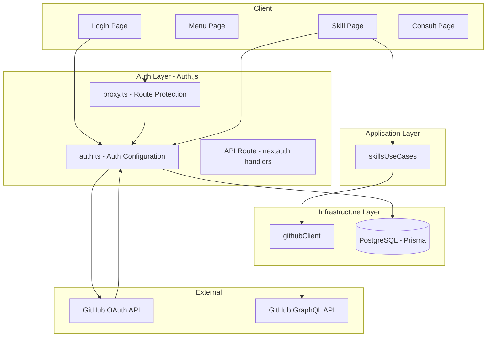
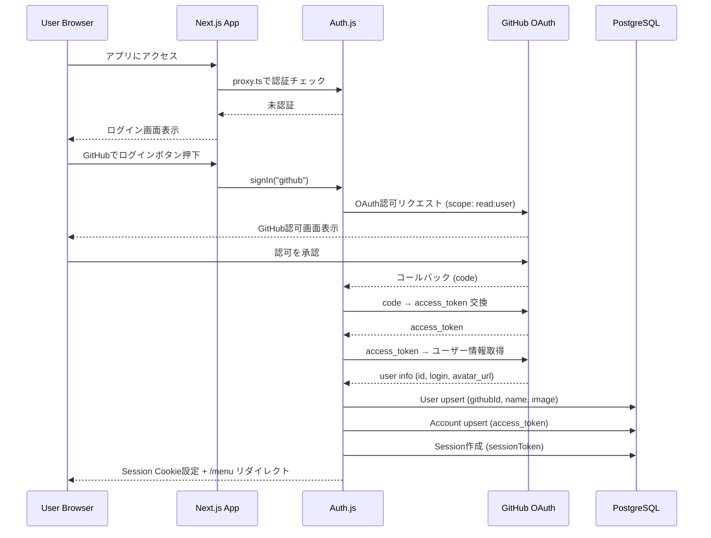
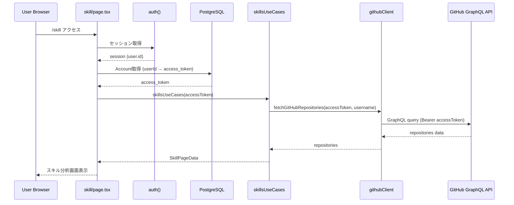
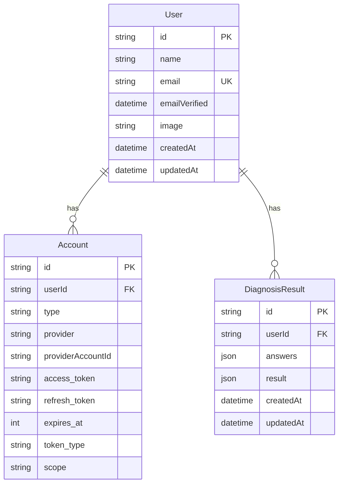

# 設計ドキュメント: dynamic-github-account

## Overview

**Purpose**: GitHub OAuthによるログイン機能を導入し、ユーザー自身のGitHubアカウントに基づいた技術力分析を動的に提供する。固定アカウントから個別ユーザーデータへの移行により、各ユーザーが自分自身のスキルセットを客観的に把握できるようになる。

**Users**: エンジニアキャリア診断を利用するすべてのユーザーが、GitHub OAuthログイン後に自身のデータに基づいたスキル分析を受ける。

**Impact**: 既存の固定GitHubアカウントによるスキル分析を、認証ベースの動的取得に切り替える。認証レイヤーの新規追加、DBスキーマ変更、GitHub APIクライアントのパラメータ化が発生する。

### Goals
- GitHub OAuthによる安全なユーザー認証の実現
- ユーザー別のGitHubデータに基づく動的スキル分析
- セッション永続化による再訪問時の利便性確保
- 認証状態に基づくルート保護

### Non-Goals
- セッション永続化以外の高度なセッション管理（マルチデバイス同期等）
- プライベートリポジトリへのアクセス
- GitHubトークンのリフレッシュ機能（将来検討）
- 管理者向けユーザー管理機能（将来的に実装）

## Architecture

### Existing Architecture Analysis

現在のアプリケーションは4層レイヤードアーキテクチャ（ページ → ユースケース → ドメイン → インフラ）を採用。認証機構は一切存在せず、全ページがパブリックアクセス。スキル分析は固定トークン・固定ユーザー名でGitHub GraphQL APIを呼び出している。

**維持すべき既存パターン**:
- Server Components / Client Componentsの分離
- `packages/server-core/`によるドメインロジック分離
- `app/application/use-cases/`によるユースケース層
- Prisma ORMによるDB操作

**変更が必要な既存コード**:
- `packages/server-core/infrastracture/githubClient.ts` — トークン・ユーザー名のパラメータ化
- `app/application/use-cases/skillsUseCases.ts` — アクセストークン引数の追加
- `app/skill/page.tsx` — セッションからユーザー情報取得
- `prisma/schema.prisma` — Auth.js用モデル追加

### Architecture Pattern & Boundary Map



**Architecture Integration**:
- 選択パターン: 既存4層レイヤードアーキテクチャにAuth.jsレイヤーを追加
- Auth.jsはNext.js App Routerに統合され、proxy.ts（ミドルウェア）とServer Componentの両方で認証チェックを実行
- 既存パターン維持: ドメインロジックの`packages/`分離、ユースケース層のオーケストレーション

### Technology Stack

| Layer | Choice / Version | Role in Feature | Notes |
|-------|------------------|-----------------|-------|
| 認証 | next-auth@beta (Auth.js v5) | GitHub OAuth、セッション管理 | Next.js 16互換確認済み |
| 認証Adapter | @auth/prisma-adapter | User/Account永続化 | 既存Prismaスキーマに統合 |
| Frontend | Next.js 16 App Router + React 19 | ログインUI、認証状態表示 | 既存スタック |
| Backend | Next.js API Routes | OAuthコールバック処理 | Auth.jsが自動生成 |
| Data | PostgreSQL + Prisma 6 | User/Account/Session保存 | 既存DB拡張 |

## System Flows

### OAuth ログインフロー



**Key Decisions**:
- Auth.jsがcode→token交換、ユーザー情報取得、DB保存を自動実行
- database戦略を採用: セッションはDBに保管し、CookieにはsessionTokenのみを格納
- access_tokenはAccountテーブルにのみ保管（クライアント側に露出しない）
- 初回ログイン時はUser+Account+Session自動作成、再ログイン時はAccount更新

### スキル分析データフロー



## Requirements Traceability

| Requirement | Summary | Components | Interfaces | Flows |
|-------------|---------|------------|------------|-------|
| 1.1 | ログイン画面表示 | LoginPage | — | OAuthフロー |
| 1.2 | GitHub OAuth認可リダイレクト | AuthConfig | signIn() | OAuthフロー |
| 1.3 | コールバック処理・トークン取得 | AuthConfig, AuthAPI | handlers, session callback | OAuthフロー |
| 1.4 | 初回ユーザーDB自動登録 | PrismaAdapter | User/Account upsert | OAuthフロー |
| 1.5 | 既存ユーザー情報更新 | PrismaAdapter | Account update | OAuthフロー |
| 1.6 | 認可拒否時エラー表示 | LoginPage | signIn error page | OAuthフロー |
| 1.7 | OAuth エラー時エラー表示 | LoginPage | error page | OAuthフロー |
| 1.8 | トークンのDB保管 | AuthConfig, PrismaAdapter | Account.access_token | OAuthフロー |
| 1.9 | OAuthスコープ最小権限 | AuthConfig | GitHub provider scope | OAuthフロー |
| 2.1 | ユーザー別スキルデータ取得 | SkillPage, SkillUseCase, GitHubClient | skillsUseCases(), fetchGitHubRepositories() | スキル分析フロー |
| 2.2 | ローディング状態表示 | SkillPage | Suspense fallback | スキル分析フロー |
| 2.3 | API取得失敗時エラー表示 | SkillPage | error handling | スキル分析フロー |
| 2.4 | 動的データソース使用 | GitHubClient | accessToken param | スキル分析フロー |
| 3.1 | 未認証リダイレクト | Proxy, AuthConfig | authorized callback | — |
| 3.2 | 認証済みアクセス許可 | Proxy | matcher config | — |
| 3.3 | ログイン後メニューリダイレクト | AuthConfig | redirect callback | OAuthフロー |
| 4.1 | セッション作成・永続化 | AuthConfig | DB Session + Cookie | OAuthフロー |
| 4.2 | セッション維持 | Proxy, AuthConfig | auth() | — |
| 4.3 | GitHubアカウント情報利用 | AuthConfig | session callback | — |
| 4.4 | セッション期限切れリダイレクト | Proxy, AuthConfig | authorized callback | — |
| 5.1 | ログアウトボタン表示 | LogoutButton | — | — |
| 5.2 | セッション破棄・リダイレクト | AuthConfig, LogoutButton | signOut() | — |

## Components and Interfaces

| Component | Domain/Layer | Intent | Req Coverage | Key Dependencies | Contracts |
|-----------|-------------|--------|--------------|-----------------|-----------|
| AuthConfig | Auth | Auth.js設定・コールバック定義 | 1.1-1.9, 3.1-3.3, 4.1-4.4, 5.2 | GitHub OAuth (P0), Prisma (P0) | Service |
| AuthAPI | Auth | OAuthコールバックハンドラ | 1.3, 1.6, 1.7 | AuthConfig (P0) | API |
| Proxy | Auth | ルート保護ミドルウェア | 3.1, 3.2, 4.2, 4.4 | AuthConfig (P0) | — |
| LoginPage | UI | ログイン画面 | 1.1, 1.2, 1.6, 1.7 | AuthConfig (P0) | State |
| LogoutButton | UI | ログアウトボタン | 5.1, 5.2 | AuthConfig (P0) | — |
| SkillPage | UI/App | 認証付きスキル画面 | 2.1-2.4 | AuthConfig (P0), SkillUseCase (P0), Prisma (P0) | — |
| SkillUseCase | Application | スキル分析オーケストレーション（拡張） | 2.1, 2.4 | GitHubClient (P0) | Service |
| GitHubClient | Infrastructure | GitHub API呼び出し（拡張） | 2.1, 2.4 | GitHub GraphQL API (P0) | Service |

### Auth Layer

#### AuthConfig

| Field | Detail |
|-------|--------|
| Intent | Auth.jsの設定・プロバイダー・コールバックを一元管理 |
| Requirements | 1.1-1.9, 3.1-3.3, 4.1-4.4, 5.2 |

**Responsibilities & Constraints**
- GitHub OAuthプロバイダーの設定（スコープ: `read:user`）
- database戦略によるサーバー側セッション管理
- Prisma Adapterによるユーザー・アカウント永続化
- `authorized`コールバックでルート保護判定
- ログイン完了後の`/menu`リダイレクト

**Dependencies**
- External: GitHub OAuth API — OAuth認証フロー (P0)
- External: @auth/prisma-adapter — DB永続化 (P0)
- Outbound: Prisma Client — User/Account CRUD (P0)

**Contracts**: Service [x]

##### Service Interface
```typescript
// auth.ts (プロジェクトルート)
import NextAuth from "next-auth"
import GitHub from "next-auth/providers/github"
import { PrismaAdapter } from "@auth/prisma-adapter"
import { prisma } from "@/lib/prisma"

// エクスポートされる関数
interface AuthExports {
  auth: () => Promise<Session | null>
  handlers: { GET: NextRouteHandler; POST: NextRouteHandler }
  signIn: (provider?: string, options?: SignInOptions) => Promise<void>
  signOut: (options?: SignOutOptions) => Promise<void>
}

// NextAuth設定
interface AuthConfig {
  adapter: PrismaAdapter
  session: { strategy: "database" }  // セッションをDBに保管、Cookieにはトークンのみ
  providers: [GitHubProvider]
  pages: {
    signIn: "/login"
    error: "/login"
  }
  callbacks: {
    session: SessionCallback  // session.user.id を含める
    authorized: AuthorizedCallback  // !!auth でルート保護
    redirect: RedirectCallback  // ログイン後 /menu にリダイレクト
  }
}
```

```typescript
// 型拡張 (types/next-auth.d.ts)
declare module "next-auth" {
  interface Session {
    user: {
      id: string
      name?: string | null
      email?: string | null
      image?: string | null
    }
  }
}
```

**access_token取得パターン** (Server Component / Use Case層):
```typescript
// セッションからuserIdを取得し、DBのAccountテーブルからaccess_tokenを取得
import { prisma } from "@/lib/prisma"

async function getAccessToken(userId: string): Promise<string | null> {
  const account = await prisma.account.findFirst({
    where: { userId, provider: "github" },
    select: { access_token: true },
  })
  return account?.access_token ?? null
}
```

**Implementation Notes**
- GitHub Providerの`authorization.params.scope`を`"read:user"`に制限
- `AUTH_GITHUB_ID`, `AUTH_GITHUB_SECRET`, `AUTH_SECRET`の環境変数が必要
- `pages.signIn`と`pages.error`を`/login`に設定し、カスタムログインページを使用
- `redirect`コールバックでログイン完了後に`/menu`へリダイレクト
- database戦略を採用: access_tokenはAccountテーブルにのみ保管し、クライアント側Cookieには露出しない
- JWTコールバックは不要（database戦略ではセッション情報はDBから直接取得）

#### AuthAPI

| Field | Detail |
|-------|--------|
| Intent | Auth.jsのOAuthコールバックハンドラをAPI Routeとして公開 |
| Requirements | 1.3, 1.6, 1.7 |

**Contracts**: API [x]

##### API Contract
| Method | Endpoint | Request | Response | Errors |
|--------|----------|---------|----------|--------|
| GET/POST | /api/auth/[...nextauth] | OAuth callbacks | Redirect | Auth.js標準エラー |

**Implementation Notes**
- `handlers`をAuthConfigからインポートしてre-export
- Auth.jsが内部的にcode→token交換、ユーザー情報取得、DB保存を実行

#### Proxy

| Field | Detail |
|-------|--------|
| Intent | Next.js 16 proxyによる認証ベースのルート保護 |
| Requirements | 3.1, 3.2, 4.2, 4.4 |

**Responsibilities & Constraints**
- 未認証ユーザーを`/login`にリダイレクト
- `/login`, `/api/auth`, 静的アセットをパブリックアクセスとして除外
- `/`（ホーム）もパブリックアクセスとして除外

```typescript
// proxy.ts
export { auth as proxy } from "@/auth"

export const config = {
  matcher: [
    "/((?!api/auth|_next/static|_next/image|favicon.ico|login|$).*)"
  ]
}
```

### UI Layer

#### LoginPage

| Field | Detail |
|-------|--------|
| Intent | GitHubログインボタンとエラーメッセージを表示するログイン画面 |
| Requirements | 1.1, 1.2, 1.6, 1.7 |

**Contracts**: State [x]

##### State Management
- URL searchParamsから`error`パラメータを取得しエラーメッセージ表示
- `signIn("github")`でOAuthフロー開始

```typescript
// app/login/page.tsx のprops
interface LoginPageProps {
  searchParams: Promise<{ error?: string; callbackUrl?: string }>
}
```

**Implementation Notes**
- Server ComponentでsearchParams取得、Client Componentでボタン操作
- エラーメッセージは汎用テキスト（「ログインに失敗しました。もう一度お試しください。」）
- OAuthエラーの詳細はサーバーログのみに記録（情報漏洩防止）

#### LogoutButton

| Field | Detail |
|-------|--------|
| Intent | ログアウトボタンを表示し、セッション破棄を実行 |
| Requirements | 5.1, 5.2 |

**Implementation Notes**
- `"use client"` Client Component
- `signOut({ callbackUrl: "/login" })`でセッション破棄後ログイン画面にリダイレクト
- メニュー画面等の共通ヘッダーに配置

### Application Layer

#### SkillUseCase（拡張）

| Field | Detail |
|-------|--------|
| Intent | アクセストークンを受け取りユーザー別スキル分析を実行 |
| Requirements | 2.1, 2.4 |

**Contracts**: Service [x]

##### Service Interface
```typescript
// 変更前
function skillsUseCases(): Promise<SkillPageData>

// 変更後
function skillsUseCases(accessToken: string): Promise<SkillPageData>
```

- Preconditions: accessTokenが有効なGitHub OAuthトークンであること
- Postconditions: SkillPageDataにユーザーのリポジトリ・言語統計を含む

**Implementation Notes**
- `fetchGitHubRepositories()`にaccessTokenを伝搬
- 既存の`aggregateLanguages()`, `mergeLanguagesAcrossRepos()`, `determineStrengthLanguage()`は変更不要

### Infrastructure Layer

#### GitHubClient（拡張）

| Field | Detail |
|-------|--------|
| Intent | OAuthトークンによるユーザー別GitHub GraphQL API呼び出し |
| Requirements | 2.1, 2.4 |

**Contracts**: Service [x]

##### Service Interface
```typescript
// 変更前
function fetchGitHubRepositories(): Promise<{
  repositories: GitHubRepository[]
  success: boolean
}>

// 変更後
function fetchGitHubRepositories(accessToken: string): Promise<{
  repositories: GitHubRepository[]
  success: boolean
}>
```

- Preconditions: accessTokenが有効であること
- Postconditions: ユーザーのパブリックリポジトリ一覧を返却

**Implementation Notes**
- 環境変数`GITHUB_TOKEN_ENCRYPTED`による固定トークン復号を廃止
- 環境変数`GITHUB_USERNAME`による固定ユーザー名指定を廃止
- GraphQLクエリの`$login`変数はトークンから自動取得（`viewer`クエリ使用）、またはセッションのユーザー名を使用
- `next: { revalidate: 3600 }`のキャッシュはユーザー別に機能するか要確認（認証ヘッダーが異なるためキャッシュされない可能性あり）

## Data Models

### Domain Model



### Physical Data Model

Auth.js Prisma Adapterが要求するスキーマ（database戦略ではSession・VerificationTokenモデルが必須）:

```prisma
model User {
  id            String    @id @default(cuid())
  name          String?
  email         String?   @unique
  emailVerified DateTime?
  image         String?
  accounts      Account[]
  sessions      Session[]
  diagnosisResults DiagnosisResult[]
  createdAt     DateTime  @default(now())
  updatedAt     DateTime  @updatedAt
}

model Account {
  id                String  @id @default(cuid())
  userId            String
  type              String
  provider          String
  providerAccountId String
  refresh_token     String?
  access_token      String?
  expires_at        Int?
  token_type        String?
  scope             String?
  id_token          String?
  session_state     String?
  user              User    @relation(fields: [userId], references: [id], onDelete: Cascade)

  @@unique([provider, providerAccountId])
}

model Session {
  id           String   @id @default(cuid())
  sessionToken String   @unique
  userId       String
  expires      DateTime
  user         User     @relation(fields: [userId], references: [id], onDelete: Cascade)
}

model VerificationToken {
  identifier String
  token      String
  expires    DateTime

  @@unique([identifier, token])
}
```

**既存スキーマへの変更**:
- `DiagnosisResult.userId`を`User.id`へのリレーションに変更（nullable維持 — 既存データ互換性）

## Error Handling

### Error Categories and Responses

**User Errors (認証関連)**:
| エラー | ユーザー表示 | 内部ログ |
|--------|-------------|----------|
| OAuth認可拒否 (1.6) | 「ログインがキャンセルされました」 | `warn: OAuth authorization denied by user` |
| OAuthプロセスエラー (1.7) | 「ログインに失敗しました。もう一度お試しください。」 | `error: OAuth callback error: {details}` |
| セッション期限切れ (4.4) | ログイン画面にリダイレクト（メッセージなし） | `info: Session expired, redirecting to login` |

**System Errors (API関連)**:
| エラー | ユーザー表示 | 内部ログ |
|--------|-------------|----------|
| GitHub API取得失敗 (2.3) | 「データの取得に失敗しました。再取得してください。」 | `error: GitHub API error: {status} {message}` |
| GitHub APIレートリミット | 「しばらく時間をおいてから再度お試しください。」 | `warn: GitHub API rate limit exceeded` |

**セキュリティ原則**: エラーメッセージは汎用テキストのみをユーザーに表示。OAuthエラーコード、スタックトレース、内部状態は一切露出しない。

## Testing Strategy

### Unit Tests
- Auth.js callbacks（session, authorized, redirect）の動作検証
- `skillsUseCases(accessToken)`のパラメータ伝搬
- `fetchGitHubRepositories(accessToken)`のトークン使用
- エラーハンドリング（無効トークン、API失敗）

### Integration Tests
- OAuthコールバック→User/Account作成フロー
- 認証済みセッションでのスキルページアクセス
- 未認証アクセスのリダイレクト動作
- ログアウト→セッション破棄→リダイレクト

### E2E Tests
- GitHubログイン→メニュー画面遷移
- スキル画面でのユーザー別データ表示
- ログアウト→ログイン画面遷移
- 未認証での各ページアクセス→リダイレクト確認

## Security Considerations

### 脅威と対策

| 脅威 | 対策 | 実装 |
|------|------|------|
| CSRF攻撃 | Double-submit cookieパターン | Auth.js自動 |
| セッションハイジャック | HttpOnly, Secure, SameSite=Lax Cookie | Auth.js自動 |
| OAuthトークン漏洩 | access_tokenはDBのみに保管（Cookieに含めない） | database戦略 + PrismaAdapter |
| OAuthリプレイ攻撃 | stateパラメータ検証 | Auth.js自動 |
| セッション固定攻撃 | ログイン時セッション再生成 | Auth.js自動 |
| 過剰な権限要求 | OAuthスコープを`read:user`に制限 | GitHub Provider設定 |
| エラーメッセージによる情報漏洩 | ユーザー向け汎用メッセージ、詳細はサーバーログのみ | カスタムエラーページ |

### Cookie Security

本番環境ではAuth.jsが自動的に以下を適用:
- `__Host-`プレフィックス（HTTPS必須、ドメイン固定）
- `HttpOnly: true`（JavaScript からアクセス不可）
- `Secure: true`（HTTPS のみ送信）
- `SameSite: Lax`（クロスサイトリクエスト制限）

### 環境変数

```
AUTH_SECRET=<ランダム生成された秘密鍵>
AUTH_GITHUB_ID=<GitHub OAuth App Client ID>
AUTH_GITHUB_SECRET=<GitHub OAuth App Client Secret>
```

- `AUTH_SECRET`はセッションCookieの署名・暗号化に使用。`openssl rand -base64 32`で生成推奨。
- GitHub OAuth App はGitHub Developer Settings で作成。Authorization callback URLは`{APP_URL}/api/auth/callback/github`を設定。

## Migration Strategy

### Phase 1: Auth.js基盤追加（非破壊）
1. `next-auth@beta`, `@auth/prisma-adapter`をインストール
2. Prismaスキーマに`User`, `Account`, `Session`, `VerificationToken`を追加
3. `auth.ts`, `app/api/auth/[...nextauth]/route.ts`を作成
4. `proxy.ts`を作成（この時点ではまだ`/login`ページがないため、全ルート許可）

### Phase 2: ログインUI + ルート保護
5. `/login`ページを作成
6. `proxy.ts`のmatcherを有効化（保護ルート設定）
7. LogoutButtonコンポーネントを作成

### Phase 3: スキル分析の動的化
8. `githubClient.ts`をパラメータ化
9. `skillsUseCases.ts`をパラメータ化
10. `skill/page.tsx`をセッション連携に変更

### Rollback
- Phase 1-2はadditive change（追加のみ）のためロールバックはgit revertで対応可能
- Phase 3で既存の固定アカウント取得コードを削除するため、ロールバック時は環境変数`GITHUB_TOKEN_ENCRYPTED`と`GITHUB_USERNAME`を復元する必要あり
