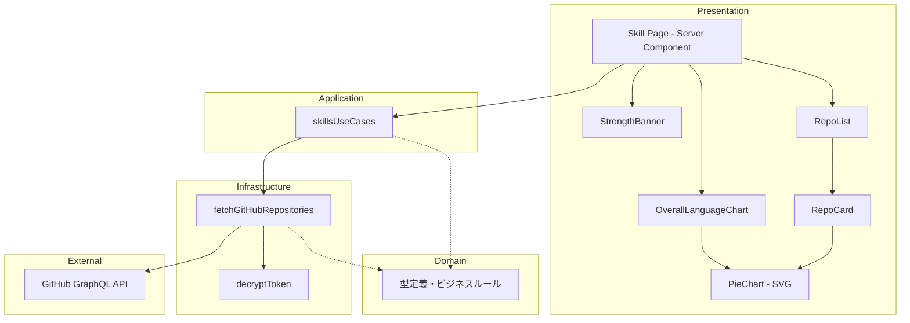
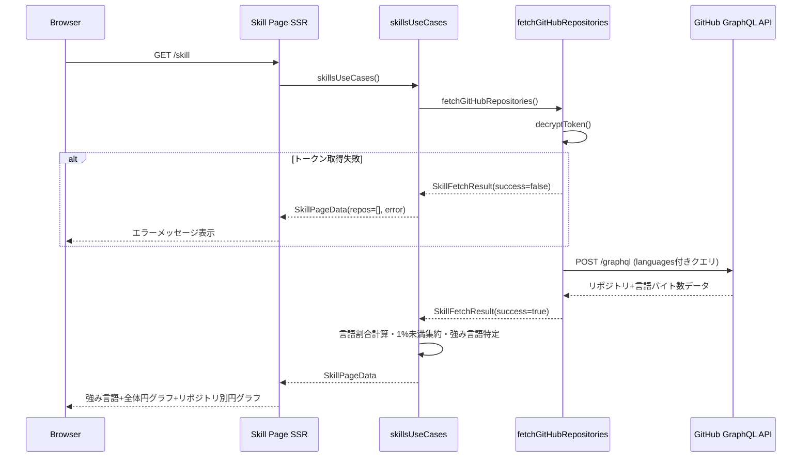
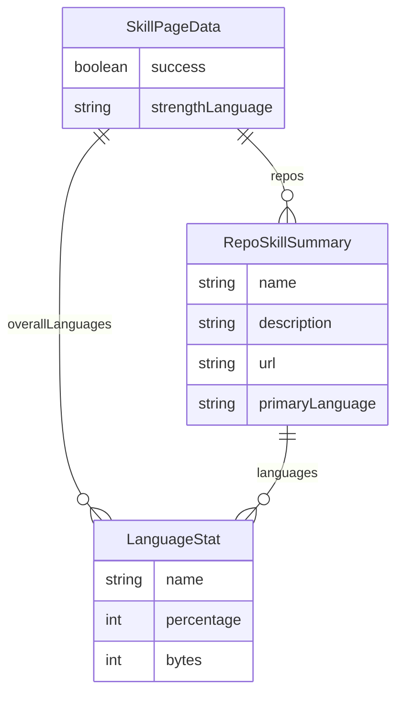

# Design Document — github-language-stats

## Overview

**Purpose**: スキルページにGitHubリポジトリの言語使用統計を追加し、エンジニアユーザーが自身の技術スキルの傾向と最大の強みを視覚的に把握できるようにする。

**Users**: エンジニアユーザーがキャリア判断の参考として技術スキルの客観的な可視化を利用する。

**Impact**: 既存のスキルページ（リポジトリ一覧表示）を拡張し、言語統計セクション（強み言語・全体円グラフ・リポジトリ別円グラフ）を追加する。

### Goals
- 各リポジトリおよび全体の言語使用割合を円グラフで可視化
- 最も使用割合の高い言語を「最大の強み」として明示表示
- Infrastructure層を新設し、API通信をDomain層から分離した5層アーキテクチャへ拡張

### Non-Goals
- リポジトリの詳細分析（コミット頻度、コード品質等）
- Private リポジトリの言語分析
- 言語使用の時系列変化の追跡
- インタラクティブなグラフ操作（ホバー、クリック等）

## Architecture

### Existing Architecture Analysis

現行のスキル機能は以下の構成だが、API通信とドメインロジックが混在している：

1. **ドメイン層**（`packages/server-core/domain/skillResult.ts`）: 型定義 + GitHub API呼び出し（混在）
2. **アプリケーション層**（`app/application/use-cases/skillsUseCases.ts`）: データ変換・ビジネスロジック
3. **プレゼンテーション層**（`app/skill/page.tsx`）: Server Component、データ取得とUI描画（コンポーネント未分離）

現行の課題：
- ドメイン層にAPI通信（外部依存）が混在 — Infrastructure層への分離が必要
- GraphQLクエリが`privacy`フィルタ未指定 — 全リポジトリを取得
- `languages(first: 1)`で1言語のみ取得 — バイト数情報なし
- UIコンポーネントがPage内にインライン — コンポーネント分離が必要

### 新アーキテクチャ（5層）

本機能を契機に、API通信をInfrastructure層として分離し、責務を明確化する：

1. **ドメイン層**（`packages/server-core/domain/`）: 型定義・ビジネスルール（フレームワーク非依存・外部通信なし）
2. **Infrastructure層**（`packages/server-core/infrastructure/`）: 外部API通信・トークン復号（新設）
3. **アプリケーション層**（`app/application/use-cases/`）: ビジネスロジックのオーケストレーション・集計
4. **プレゼンテーション層 - Page**（`app/skill/page.tsx`）: Server Component、データ取得とレイアウト
5. **プレゼンテーション層 - Component**（`app/components/`）: 再利用可能なUIコンポーネント

### ディレクトリ構造（本機能で変更・新設するファイル）

```
packages/server-core/
├── domain/
│   └── skillResult.ts              # 型定義のみに縮小（API通信ロジック除去）
├── infrastructure/                  # 【新設】Infrastructure層
│   └── githubClient.ts             # fetchGitHubRepositories, decryptToken
└── utilities/
    └── encryption.ts               # 既存（変更なし）

app/
├── application/
│   └── use-cases/
│       └── skillsUseCases.ts       # 拡張（集計ロジック追加、import先変更）
├── components/
│   ├── PieChart.tsx                # 【新設】SVGドーナツチャート
│   ├── StrengthBanner.tsx          # 【新設】強み言語バナー
│   ├── OverallLanguageChart.tsx    # 【新設】全体言語割合セクション
│   └── RepoCard.tsx               # 【新設】リポジトリカード
└── skill/
    ├── page.tsx                    # 拡張（コンポーネント統合・レイアウト変更）
    └── loading.tsx                 # 【新設】ローディングスピナー
```

### Architecture Pattern & Boundary Map



**Architecture Integration**:
- Selected pattern: 5層レイヤードアーキテクチャ（Infrastructure層新設）
- Domain/feature boundaries: ドメイン層は型定義・ルールのみ、Infrastructure層がAPI通信、アプリケーション層で集計、プレゼンテーション層で表示
- Existing patterns preserved: Server Component優先、`@/`パスエイリアス、camelCase/PascalCase命名
- New layer rationale: Infrastructure層（`packages/server-core/infrastructure/`）を新設し、API通信・トークン復号をドメイン層から分離。DDD的に正しい責務分離を実現
- Steering compliance: `packages/`へのロジック分離、Tailwind CSSによるスタイリング

### Technology Stack

| Layer | Choice / Version | Role in Feature | Notes |
|-------|------------------|-----------------|-------|
| Frontend | React 19 + SVG | 円グラフ描画・UIコンポーネント | Server Componentで描画 |
| Styling | Tailwind CSS 4 | レイアウト・装飾 | 既存パターン踏襲 |
| Backend | Next.js 16 App Router | Server Componentデータフェッチ | `next.revalidate`でキャッシュ |
| External API | GitHub GraphQL API | 言語バイト数データ取得 | 1回のクエリで完結 |
| Security | AES-256-GCM + `.env.key` | トークン暗号化 | 既存パターン踏襲 |

## System Flows



**Key Decisions**:
- 全処理はServer Side（SSR）で完結 — トークンがクライアントに露出しない
- ローディング状態はNext.jsの`loading.tsx`で対応（非機能要件6）

## Requirements Traceability

| Requirement | Summary | Components | Interfaces | Flows |
|-------------|---------|------------|------------|-------|
| 1.1 | リポジトリ別言語割合パーセンテージ表示 | RepoCard | LanguageStats | SSRフロー |
| 1.2 | リポジトリ別円グラフ+凡例 | RepoCard, PieChart | PieChartProps | SSRフロー |
| 1.3 | 1%未満言語の「その他」集約 | skillsUseCases | aggregateLanguages | 集計処理 |
| 1.4 | バイト数ベース計算・四捨五入 | skillsUseCases | aggregateLanguages | 集計処理 |
| 1.5 | 言語データなしリポジトリの非表示 | RepoCard | LanguageStats | 条件付きレンダリング |
| 2.1 | 全体言語割合パーセンテージ表示 | OverallLanguageChart | OverallStats | SSRフロー |
| 2.2 | 全体円グラフ+凡例 | OverallLanguageChart, PieChart | PieChartProps | SSRフロー |
| 2.3 | 全体集計での1%未満集約 | skillsUseCases | aggregateLanguages | 集計処理 |
| 2.4 | 降順表示 | OverallLanguageChart | OverallStats | ソート処理 |
| 2.5 | 全体セクションを上部配置 | SkillPage | — | レイアウト |
| 3.1 | 最大の強み言語表示 | StrengthBanner | SkillPageData | SSRフロー |
| 3.2 | 同率時Unicode昇順 | skillsUseCases | determineStrength | 集計処理 |
| 3.3 | 強み言語を上部に目立つ配置 | StrengthBanner | — | レイアウト |
| 3.4 | 言語データなし時の非表示 | StrengthBanner | SkillPageData | 条件付きレンダリング |
| 4.1 | 言語名+バイト数取得 | fetchGitHubRepositories | GitHubLanguageEdge | APIクエリ |
| 4.2 | 最大20言語取得 | fetchGitHubRepositories | GraphQLクエリ | APIクエリ |
| 4.3 | 成功・失敗・0件の判別 | fetchGitHubRepositories | SkillFetchResult | 返却型 |
| 4.4 | API失敗時の空リスト返却 | fetchGitHubRepositories | SkillFetchResult | エラーハンドリング |
| 4.5 | トークン未設定時の空リスト返却 | fetchGitHubRepositories | SkillFetchResult | エラーハンドリング |
| 4.6 | 0件時メッセージ表示 | SkillPage | SkillPageData | 条件付きレンダリング |

## Components and Interfaces

| Component | Layer | Intent | Req Coverage | Key Dependencies | Contracts |
|-----------|-------|--------|--------------|-----------------|-----------|
| GitHubRepository, etc. | ドメイン | 型定義・ビジネスルール | — | — | — |
| fetchGitHubRepositories | Infrastructure | GitHub API通信・トークン復号 | 4.1-4.5 | GitHub GraphQL API (P0) | Service |
| skillsUseCases | アプリケーション | 言語集計・強み判定 | 1.3, 1.4, 2.1, 2.3, 2.4, 3.1, 3.2 | fetchGitHubRepositories (P0) | Service |
| SkillPage | プレゼンテーション | レイアウト・データフェッチ | 2.5, 3.3, 4.6 | skillsUseCases (P0) | — |
| StrengthBanner | プレゼンテーション | 最大の強み言語バナー | 3.1, 3.3, 3.4 | — | — |
| OverallLanguageChart | プレゼンテーション | 全体言語割合セクション | 2.1, 2.2, 2.4 | PieChart (P1) | — |
| RepoCard | プレゼンテーション | リポジトリ別言語表示 | 1.1, 1.2, 1.5 | PieChart (P1) | — |
| PieChart | プレゼンテーション | SVG円グラフ描画 | 1.2, 2.2, NFR-8 | — | — |

### ドメイン層

#### 型定義（`packages/server-core/domain/skillResult.ts`）

| Field | Detail |
|-------|--------|
| Intent | GitHub APIレスポンスおよびアプリケーション内で使用する型を定義する |
| Requirements | — (全層から参照) |

**Responsibilities & Constraints**
- 型定義・インターフェースのみ（実装ロジックなし・外部通信なし）
- 全層から参照される共通の型を提供

**Contracts**: —（型定義のみ）

```typescript
/** 言語エッジ（名前+バイト数） */
export type GitHubLanguageEdge = {
  size: number;
  node: {
    name: string;
  };
};

/** リポジトリ型（拡張） */
export type GitHubRepository = {
  name: string;
  description: string | null;
  url: string;
  primaryLanguage: { name: string } | null;
  languages: {
    totalSize: number;
    edges: GitHubLanguageEdge[];
  };
};

/** API応答のラッパー型（Infrastructure層内部で使用） */
export type GitHubUserRepositories = {
  data: {
    user: {
      repositories: {
        nodes: GitHubRepository[];
      };
    };
  };
};

/** 取得結果（成功/失敗を判別可能） */
export type SkillFetchResult = {
  repositories: GitHubRepository[];
  success: boolean;
};
```

### Infrastructure層（新設）

#### fetchGitHubRepositories（`packages/server-core/infrastructure/githubClient.ts`）

| Field | Detail |
|-------|--------|
| Intent | GitHub GraphQL APIから言語バイト数データを含むリポジトリ情報を取得する |
| Requirements | 4.1, 4.2, 4.3, 4.4, 4.5 |

**Responsibilities & Constraints**
- GraphQL APIへの1回のクエリでリポジトリ+言語データを取得
- トークン復号・認証処理（`decryptToken`を内部で使用）
- Publicリポジトリのみを対象（`privacy: PUBLIC`）
- 成功・失敗・0件を呼び出し側が判別できる返却形式

**Dependencies**
- External: GitHub GraphQL API — 言語データ取得 (P0)
- External: `packages/server-core/utilities/encryption.ts` — トークン復号 (P0)
- Inbound: skillsUseCases — データ取得呼び出し (P0)

**Contracts**: Service [x]

##### Service Interface

```typescript
function fetchGitHubRepositories(): Promise<SkillFetchResult>;
```

- Preconditions: `GITHUB_TOKEN_ENCRYPTED`環境変数と`.env.key`ファイルが存在する（なければ失敗扱い）
- Postconditions: `success: true`の場合、`repositories`にPublicリポジトリ一覧（言語データ付き）を格納。`success: false`の場合、`repositories`は空配列
- Invariants: トークンがクライアントサイドに露出しない

**拡張GraphQLクエリ**:

```graphql
query($login: String!) {
  user(login: $login) {
    repositories(first: 100, privacy: PUBLIC) {
      nodes {
        name
        description
        url
        primaryLanguage {
          name
        }
        languages(first: 20) {
          totalSize
          edges {
            size
            node {
              name
            }
          }
        }
      }
    }
  }
}
```

**Implementation Notes**
- 既存`skillResult.ts`からAPI通信ロジック（`decryptToken`、`fetch`呼び出し）を移動
- `fetch`呼び出しに`next: { revalidate: 3600 }`を追加（非機能要件7）
- `GitHubUserRepositories`（API応答型）から`SkillFetchResult`への変換はこの層で実施
- 既存の`fetchGitHubRepositories`関数は`fetchGitHubRepositories`に改名して移動

### アプリケーション層

#### skillsUseCases（拡張）

| Field | Detail |
|-------|--------|
| Intent | 取得したリポジトリデータを集計し、言語割合・強み言語を含むページデータに変換する |
| Requirements | 1.3, 1.4, 2.1, 2.3, 2.4, 3.1, 3.2 |

**Responsibilities & Constraints**
- 言語割合の計算（バイト数ベース）
- 1%未満言語の「その他」集約（四捨五入前の割合で判定）
- 表示用パーセンテージの四捨五入（小数点第1位）
- 全リポジトリ横断の言語集計
- 最大の強み言語の特定（同率時Unicode昇順）

**Dependencies**
- Inbound: SkillPage — ページデータ取得 (P0)
- Outbound: fetchGitHubRepositories — API呼び出し (P0)

**Contracts**: Service [x]

##### Service Interface

```typescript
/** 言語割合（表示用） */
type LanguageStat = {
  name: string;       // 言語名（「その他」を含む）
  percentage: number;  // 四捨五入済みパーセンテージ（整数）
  bytes: number;       // 元のバイト数
};

/** リポジトリ別スキルサマリー */
type RepoSkillSummary = {
  name: string;
  description: string | null;
  url: string;
  primaryLanguage: string | null;
  languages: LanguageStat[];  // 降順、1%未満は「その他」に集約済み
};

/** スキルページ全体のデータ */
type SkillPageData = {
  success: boolean;
  repos: RepoSkillSummary[];
  overallLanguages: LanguageStat[];  // 全リポジトリ横断、降順
  strengthLanguage: string | null;    // 最大の強み言語（null=データなし）
};

function skillsUseCases(): Promise<SkillPageData>;
```

- Preconditions: なし（内部でfetchGitHubRepositoriesを呼び出し）
- Postconditions: `success: true`の場合、`repos`にリポジトリ別言語統計、`overallLanguages`に全体統計、`strengthLanguage`に最大の強み言語を格納
- Invariants: 各`LanguageStat.percentage`の合計は100（四捨五入誤差を許容）

**集計ロジック（純粋関数として分離）**:

```typescript
/** 言語バイト数から割合を計算し、1%未満を「その他」に集約 */
function aggregateLanguages(
  edges: GitHubLanguageEdge[],
  totalSize: number
): LanguageStat[];

/** 全リポジトリの言語バイト数を合算 */
function mergeLanguagesAcrossRepos(
  repos: GitHubRepository[]
): LanguageStat[];

/** 最大の強み言語を特定（同率時Unicode昇順） */
function determineStrengthLanguage(
  languages: LanguageStat[]
): string | null;
```

**Implementation Notes**
- `aggregateLanguages`は共通計算ルール（要件書「言語割合の計算ルール」）を実装
- 各関数は純粋関数として実装し、ユニットテスト容易にする

### プレゼンテーション層

#### StrengthBanner

| Field | Detail |
|-------|--------|
| Intent | 最大の強み言語を「あなたの最大の強みは〇〇です」形式で目立つバナー表示 |
| Requirements | 3.1, 3.3, 3.4 |

**Implementation Notes**
- `strengthLanguage`がnullの場合は非表示（条件付きレンダリング）
- Tailwind CSSで背景色・フォントサイズを強調
- Server Component（インタラクション不要）

#### OverallLanguageChart

| Field | Detail |
|-------|--------|
| Intent | 全リポジトリ横断の言語割合を円グラフと凡例で表示 |
| Requirements | 2.1, 2.2, 2.4 |

**Implementation Notes**
- `PieChart`コンポーネントに`overallLanguages`を渡す
- 凡例は言語名+パーセンテージのリスト（降順）
- Server Component

#### RepoCard

| Field | Detail |
|-------|--------|
| Intent | リポジトリ情報と言語割合円グラフを表示 |
| Requirements | 1.1, 1.2, 1.5 |

**Implementation Notes**
- 既存のリポジトリ表示（名前・説明・リンク）を維持
- `languages`が空の場合、円グラフセクションを非表示
- Server Component

#### PieChart（新規・再利用可能）

| Field | Detail |
|-------|--------|
| Intent | SVGベースの円グラフ（ドーナツチャート）を描画する汎用コンポーネント |
| Requirements | 1.2, 2.2, NFR-8 |

**Contracts**: State [x]

##### State Management

```typescript
type PieChartProps = {
  data: LanguageStat[];
  size?: number;         // SVGの幅・高さ（px、デフォルト: 160）
  strokeWidth?: number;  // ドーナツの太さ（デフォルト: 32）
};
```

**Implementation Notes**
- SVG `<circle>`要素の`stroke-dasharray`と`stroke-dashoffset`で各セグメントを描画
- 言語ごとに固定カラーパレット（TypeScript: blue, Python: green, etc.）を定義
- アクセシビリティ: `role="img"` + `aria-label`で全体説明、凡例リストに数値を併記（NFR-8）
- Server Component（SVGはSSRで描画可能）

## Data Models

### Domain Model



- **SkillPageData**: ページ全体の集約ルート。成功フラグ・強み言語・全体統計・リポジトリ一覧を保持
- **RepoSkillSummary**: 個別リポジトリの表示データ。既存`SkillSummary`の拡張
- **LanguageStat**: 言語割合の値オブジェクト。計算済みパーセンテージとバイト数を保持

### Data Contracts & Integration

**GitHub GraphQL APIレスポンス → SkillFetchResult変換**:
- `response.data.user.repositories.nodes` → `SkillFetchResult.repositories`
- HTTPステータス・例外 → `SkillFetchResult.success`

**SkillFetchResult → SkillPageData変換**（アプリケーション層）:
- 各`GitHubRepository.languages.edges` → `RepoSkillSummary.languages`（`aggregateLanguages`で変換）
- 全リポジトリの`edges`を合算 → `SkillPageData.overallLanguages`（`mergeLanguagesAcrossRepos`で変換）
- `overallLanguages[0].name` → `SkillPageData.strengthLanguage`（`determineStrengthLanguage`で決定）

## Error Handling

### Error Strategy
Server Componentのため、エラーはSSR時に処理し、ユーザーには適切なフォールバックUIを表示する。

### Error Categories and Responses
- **トークン未設定/復号失敗**: `SkillFetchResult.success = false` → 既存メッセージ「スキル情報を取得できませんでした。」を表示
- **GitHub API応答エラー（4xx/5xx）**: `SkillFetchResult.success = false` → コンソールにエラー出力 + 同上メッセージ
- **API成功・リポジトリ0件**: `SkillFetchResult.success = true, repositories = []` → 「リポジトリが見つかりません」を表示
- **言語データなし（個別リポジトリ）**: 該当リポジトリの円グラフセクションを非表示

## Testing Strategy

### Unit Tests
- `aggregateLanguages`: 1%未満集約、四捨五入、空配列、全言語1%未満
- `mergeLanguagesAcrossRepos`: 複数リポジトリの合算、言語名の統合
- `determineStrengthLanguage`: 通常ケース、同率ケース（Unicode昇順）、空配列
- `LanguageStat`のパーセンテージ合計が100であること

### Integration Tests
- `skillsUseCases`: fetchGitHubRepositoriesからの変換・集計の正確性
- GraphQLクエリに`privacy: PUBLIC`と`languages(first: 20)`が含まれること

### E2E Tests（Cypress）
- トークン設定済み: 強み言語バナー・全体円グラフ・リポジトリ別円グラフの表示確認
- トークン未設定: エラーメッセージ表示・言語セクション非表示の確認
- アクセシビリティ: スクリーンリーダーで言語情報を読み取れること

## Security Considerations

- **トークン保護**: 全処理がServer Componentで完結し、トークンはクライアントに送信されない（受入条件7, 9）
- **暗号化**: 既存AES-256-GCM + `.env.key`パターンを変更なく踏襲（受入条件8）
- **Publicリポジトリ限定**: GraphQLクエリに`privacy: PUBLIC`を明示的に指定（非機能要件1）

## Performance & Scalability

- **キャッシュ**: `fetch`に`next: { revalidate: 3600 }`を設定し、1時間間隔で再検証（非機能要件7）
- **レート制限**: 1クエリで完結、N+1なし（非機能要件3, 4）
- **バンドルサイズ**: 外部チャートライブラリなし、SVGのみ（非機能要件5）
- **ローディング**: `app/skill/loading.tsx`でSuspenseベースのスピナー表示（非機能要件6）
